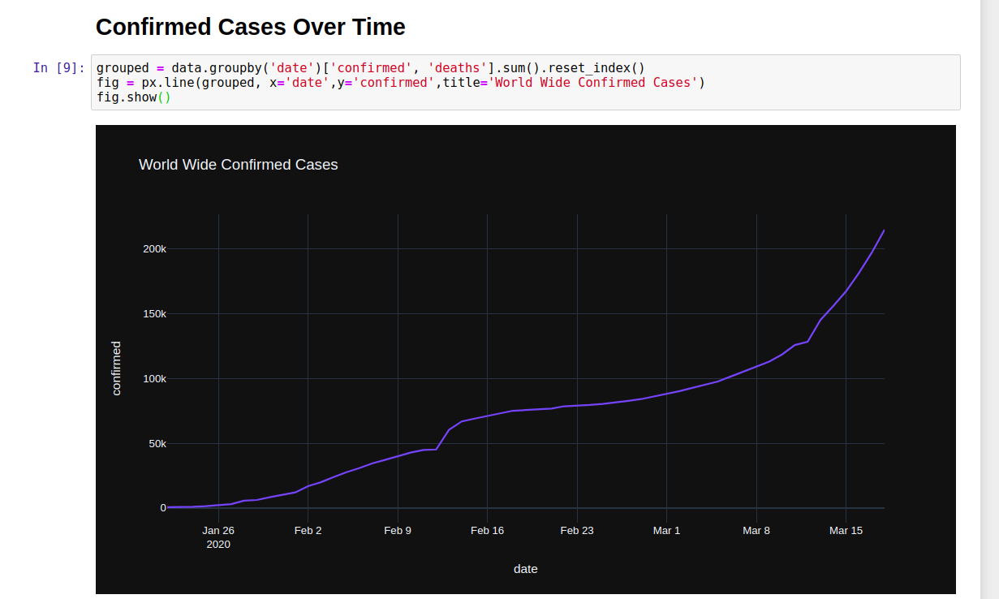
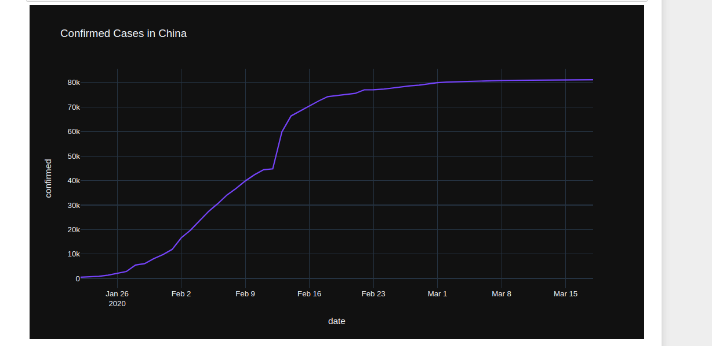
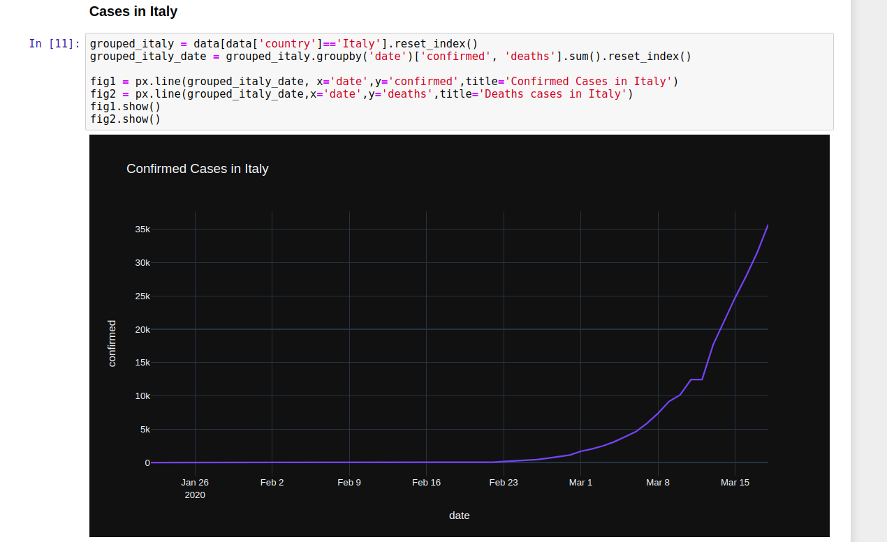
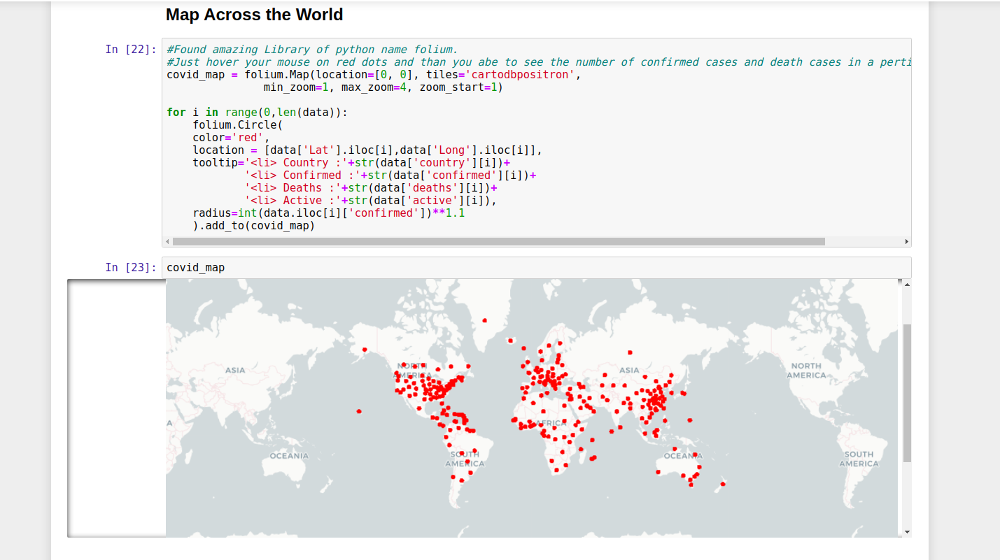
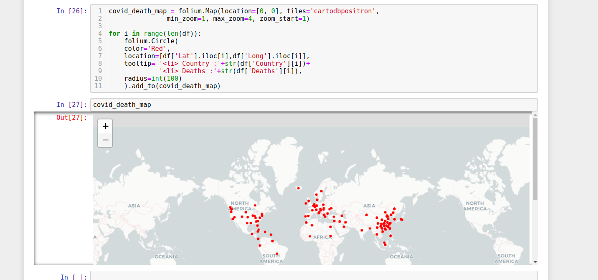

# COVID-19

In the context of the global COVID-19 pandemic, Kaggle has launched several challenges in order to provide useful insights that may answer some of the open scientific questions about the virus. This is the case of the COVID19 Global Forecasting, in which participants are encouraged to fit worldwide data in order to predict the pandemic evolution, hopefully helping to determine factors that impact the transmission rate of COVID-19.

<h1>Visualization</h1>
<h2> Confirmed Cases Over Time</h2>

<h2> Confirmed Cases in China(3 Months)</h2>

<h2> Cases in Italy</h2>

In between Visualization i found powerful python library that help you for generating crime maps.

<h1>FOLIUM</h1>

Folium is a powerful Python library that helps you create several types of Leaflet maps. The fact that the Folium results are interactive makes this library very useful for dashboard building. To get an idea, just run my python notebook and hover your mouse around red dot points.

<h2>Deaths all over the World due to covid 19</h2>

For more information follow my notebook

